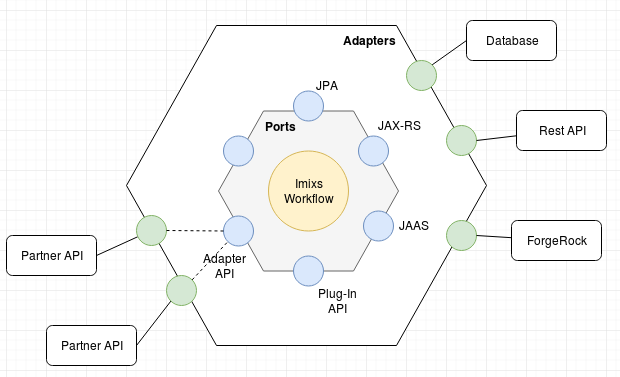
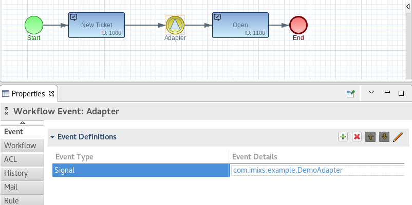
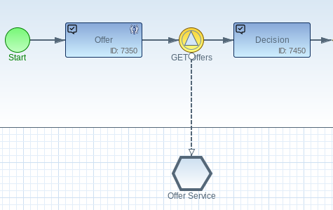

# Hexagonal Architecture

Hexagonal architecture is a model or pattern to design a software application. It was proposed by Alistair Cockburn in 2005. The idea behind it is to put inputs and outputs at the edges of a system design consisting of different services which fits into modern microservice architecture design.

Applying the Hexagonal architecture the central logic of a microservice like the _Imixs-Workflow_ can be isolated from outside services. Having inputs and outputs at the edge allows to swap out service handlers without changing the core of the service. This makes it easier to test also complex systems. In test scenarios services can be mocked, which makes the tests more stable.

The core idea of the hexagonal architecture model are Ports and Adapters. 
A single service is modeled as a hexagon shape with another, larger hexagon shape around it. The center hexagon is the core of the service (in this case the Imixs-Workflow service). The layer between the core and the outer hexagon is the adapter layer. The inner hexagon defines the ports, the outer hexagon represents the adapters.

## Ports

Ports define the internal interfaces of the core service. The interfaces define the language of the core. The Imixs-Workflow service includes different ports for internal use only. These are mainly the Jarkata EE core APIs like JPA, EBJ, Jax-RS.  To adapt the behavior of the processing logic provided by the Imixs-Workflow engine additional interfaces are defined:

 * _Plug-In API_ - this is the standard extension mechanism of the Imixs-Workflow Engine
 * _Adapter API_ - a extension mechanism to adapt the processing life cycle of a BPMN Event

The adapter API is the core interface to adapt external services. It is also the main solution block for this architecture. 

## Adapters

Adapters are the concrete implementation of an Interface (port). This is how data is either handled or passed along. Data might go to a database, a file, or a network call over HTTP. Within the Imixs LAMP Stack Adapters can be implemented either as a SignalAdapter or GenericAdapter class. Depending on its type, the Adapter class is executed before or after the plug-in processing life-cycle, controlled by the WorkflowKernel. 

See the Section "[Adapter Design](./ADAPTER_DESIGN.md)" for further details. 

## BPMN Conversations

In BPMN a Call Conversation element is used to describe the place where a service is called. 
It is an informal description within a collaboration diagram to show how Services and Events are related. The view includes two additional graphical elements that do not exist in other BPMN  views:

 * Conversation Node elements (Conversation , Sub-Conversation, and Call Conversation)
 * A Conversation Link

A Conversation is a logical grouping of a service or participant. The conversation link is the logical relation of Message exchanges. In practice, in Signal Adapter assigned to an Event is  responsible for the communication and data exchange. 

In an hexagonal architecture the BPMN Call Conversation is a helpful element to describe a link to an external service. From a technical perspective the Conversation element has no function. The service call is completely covered by the signal event. A call Conversation element is optional and can be left in a pure technical process design. 

