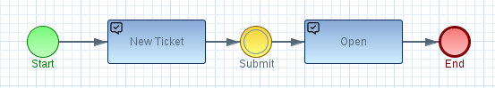
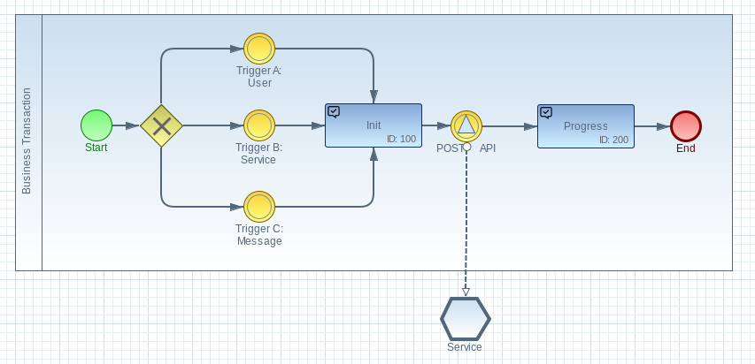
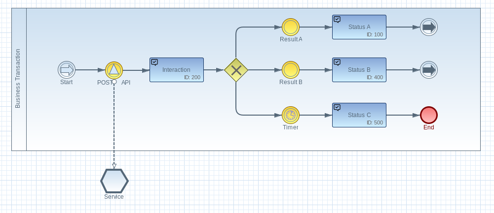
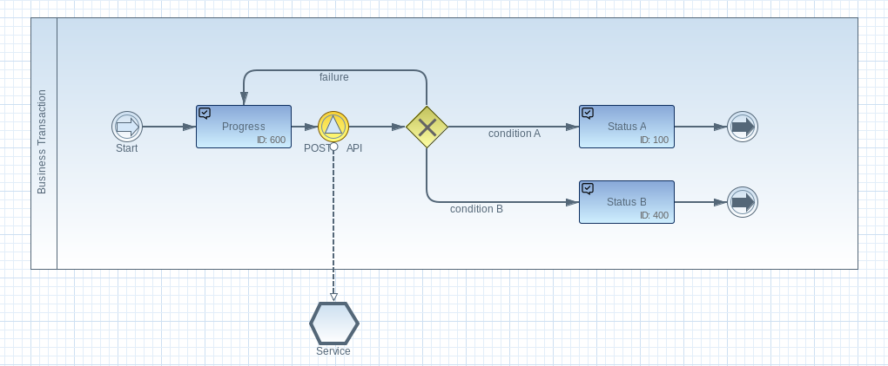
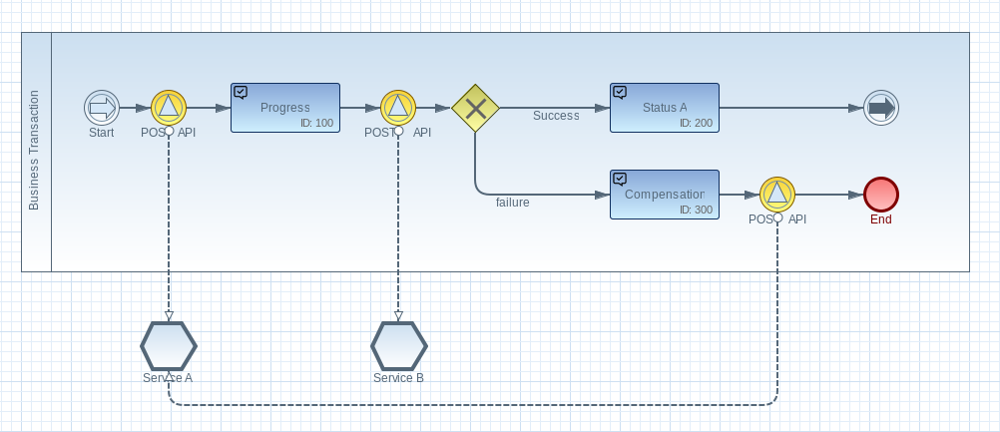

# Process Design

The following section describes how a business transaction is designed within the Imixs LAMB stack. A process design follows the _[Business Process Modeling Notation](http://www.bpmn.org/) (BPMN)_. BPMN 2.0 is the common standard to describe a business process. It was initially designed to describe a business process without all the technical details of a software system. As an result, a BPMN diagram is easy to understand and a good starting point to talk about a business process with technician as also with management people.

Imixs-BPMN is a free modeling tool which takes the full advantage of all the capabilities of BPMN 2.0 and complements them with the features of a powerful workflow engine. As a result a BPMN model in the Imixs LAMB stack is a technical model containing a complete process description including technical process details. Since BPMN is based on XML, it can be created with different tooling and also computed from code.

A technical model of a business transaction can be deployed into the Imixs LAMB stack to make a business process executable.   

Beside the concepts of BPMN also a good understanding of concepts like the 'Inter Process Communication', 'Compensating Transactions' and the 'Service Orchestration' are relevant at this point. A brief overview about this concepts can be found in the section '[Business Transactions with SAGAS](SAGAS.md)'

## Tasks & Events

The core concept of a process design based on the BPMN 2.0 standard is to split a business transaction into _Tasks_ and _Events_. 

The rectangles symbolize a _Task Element_ defining a unique state within the process. The circle symbols describe an _Event Element_ that changes the state within the process. This example above contains two tasks: ‘New Ticket’ and ‘Open’ and the event ‘Submit’.

A running business transaction is always assigned to exactly one task within a specific model. This is called also a _Process Instance_. Events can be triggered by a human participant, by an external service or an internal trigger (e.g. a timer event). This type of modeling is also known as _event-driven modeling_. 

# Initializing a Business Transaction

A business transaction can be initialized by diverse triggers. This can be 

 * a user interaction
 * an external service call e.g. from a web service
 * a message received from a message broker

Each trigger is defined by a initial _BPMN Event_. 
The goal of the initial event is to persist the process instance in an initial state. This initial state is the starting point for further events or service calls.
It is not recommended to define an Adapter in an initial event because an adapter can cause an error leading to an undefined initial status. This applies also to the pattern of separation of concerns. 

# Interaction Transaction

Depending on the outcome of a service call, an interaction with a participant may be required. This is called an interaction transactin.

The Imixs LAMB Stack holds the interaction state until a predefined event is received. In case no result arrives within a defined period, a timer event can be used to exit the current state.

# Conditional Transaction

Depending on the outcome of a service call, a conditional event can define different target states. No interaction with a participant is required here. 

A condition typically is evaluated on a business rule based on the data provided by a service call. 

# Compensating Transaction

A compensating transaction descirebes a process flow where different service calls are used to rollback local transactions.

Compensation transactions often require a more sophisticated process design, because it may take several compensating transaction calls running in a reverse order. Each compensating transaction call  should be modeled with its own intermediate status.

