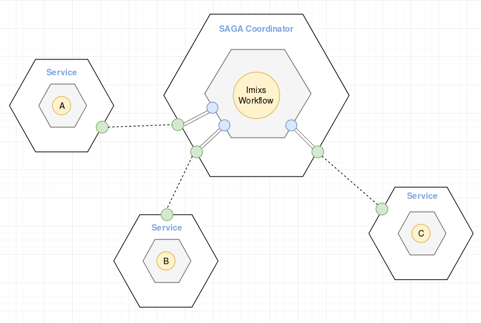
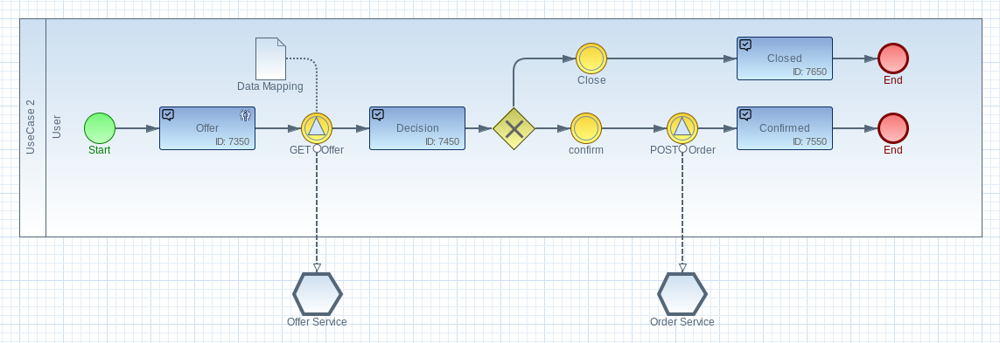

# The Imixs LAMB Stack

The Lightweight Architecture for Microservice Business-Transactions is a concept to simplify the management of transactional business cases in a microservice architecture. A **Business Transaction** is a long running logical sequence of service calls to achieve a business goal. 
 The core concept of the Imixs LAMB stack is based on the _Microservice SAGA pattern_. This design pattern allows the management of different microservices in a coherent business transaction. You will find a short introduction into the Microservice Saga pattern [here](SAGAS.md)

The Imixs LAMB stack simplifies the design of business transactions with the help of the modeling standard BPMN 2.0. As a result, even complex business processes with a large number of different services calls can be transformed into a clear and stable process design.

The Imixs LAMB stack introduces the concept of compensating transactions that solve the problem of a weak isolation within a distributed microservice architecture.
In this sense a business transaction managed by the Imixs LAMB stack can be considered to be ACD

 * Atomicity — The Imixs LAMB Stack ensures that all transactions are executed or all changes are undone.
 * Consistency — Referential integrity within a service is handled by local databases. Referential integrity across services is handled by the Imixs LAMB Stack.
 * Durability — The durability of data is handled by local databases within a service.
 
 
## Architecture

The LAMB Stack consists of a number of microservices. A single LAMB Service defines a bounded context as a business model. The boundaries are business-oriented and based on the idea of the SAGA pattern. 
The LAMB Service takes the role of the SAGA coordinator and is responsible to coordinate the business transactions by calling one or many external services (paticipants).

This kind of diagram is also called 'Hexagonal Architecture'. You will find details about this architectural style [here](HEXAGONAL_ARCHITECTURE.md).

### Business Transactions and BPMN 

A Business Transaction within the Imixs LAMP Stack is defined by a BPMN model describing the _process flow_, _service calls_ and also optional _compensating transactions_.

Each service call is defined by a so called [Adapter](ADAPTER_DESIGN.md). The adapter is designed as a _Signal Event_ and is responsible to control the data flow between the business transaction and the local transaction within the service call. 
The configuration of a data mapping is part of the model defined in a _Data Object_ element. The section [Process Design](PROCESS_DESIGN.md) provides detailed information about how to model a business transaction.

### Further Content

The following sections the different concept in more detail:

 * [Hexagonal Architecture](HEXAGONAL_ARCHITECTURE.md)  Describes a generic modeling pattern to designing software applications in a microservice architecture
 * [Business Transactions with SAGAS](SAGAS.md)  Describes how to maintain data consistency across services a microservice-based application 
 * [Adapter Design](ADAPTER_DESIGN.md)   Details about the Adapter implementation
 * [Process Design](PROCESS_DESIGN.md)   An overview how business transactions can be modeled with BPMN
 