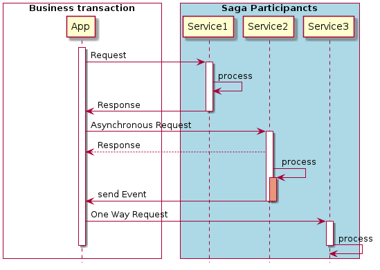

# Business Transactions with SAGAS

The Microservice Architecture brings up a new way to build modern software systems. The idea is to decouple monolithic software blocks to speed up and simplify the software development. The Microservice architecture evolves very fast and brings up a lot of new concepts.
However, the Microservice Architecture also has some drawbacks and problems.

A distributed system always increases the complexity.  Services must use an interprocess communication mechanism and must be designed to handle partial failure and deal with the remote service either being unavailable or exhibiting high latency. Especially implementing a use case that span multiple services  makes it a challenge to implement business transactions. To maintain data consistency across services a microservice-based application must use what are known as sagas.

## Sagas

When  starting with a microservice architecture, one of her biggest concerns often is how to implement transactions that span multiple services. Transactions are an essential ingredient of every enterprise application. Without transactions it would be impossible to maintain data consistency.
ACID (Atomicity, Consistency, Isolation, Durability) transactions greatly solve the problem by providing the illusion that each transaction has exclusive access to the data. In a microservice architecture, transactions that are within a single service can still use ACID transactions. The challenge, however, lies in implementing transactions for operations that update data owned by multiple services.

### Distributed Transactions

The traditional approach to maintaining data consistency across multiple services, databases, or message brokers is to use distributed transactions. The [XA Standard](https://en.wikipedia.org/wiki/X/Open_XA) provides a two-phase commit (2PC) to ensure that all participants in a transaction either commit or rollback. An XA-compliant technology stack consists of XA-compliant databases and message brokers, database drivers, and messaging APIs, and an interprocess communication mechanism that propagates the XA global transaction ID. Most SQL databases are XA compliant, as are some message brokers. Java EE applications can, for example, use JTA to perform distributed transactions.

However, there are a variety of problems with distributed transactions in a modern microservice architecture. One problem is that many newer technologies, including NoSQL databases such as MongoDB and Cassandra, don’t support XA. Also, distributed transactions aren’t supported by modern message brokers such as RabbitMQ and Apache Kafka.

** As a result, XA offers no solution for distributed transaction in a Microservice Architecture.**

### Maintain Data Consistency

The _Saga Pattern_ is a mechanism to maintain data consistency in a microservice architecture without having to use distributed transactions. A saga describes a sequence of local transactions to update data in multiple services. Each local transaction updates data within a single service using the  ACID transaction frameworks locally in each service.

**Pattern: Saga** 

*Maintain data consistency across services using a sequence of local transactions that are coordinated using asynchronous messaging.*

http://microservices.io/patterns/data/saga.html.

#### Compensating Transactions to Roll Back Changes

A great feature of traditional ACID transactions is that the business logic can easily roll back a transaction if it detects the violation of a business rule. It executes a ROLL-BACK statement, and the database undoes all the changes made so far. 

A distributed transaction in a Microservice Architecture  can’t be automatically rolled back, because each service commits its changes to the local database. 

This means, that if within a business transaction one local transaction fails, the saga must explicitly undo the changes made in already committed local transactions of previous steps. 

This is known as compensating transactions which is an important concept to maintain data consistency within a long running business transaction.

### Coordinating sagas

A saga’s implementation consists of logic that coordinates the steps of the saga.
 When a saga is initiated by system command, the coordination logic must select and tell the first saga participant to execute a local transaction. Once that transaction completes, the saga’s sequencing coordination selects and invokes the next saga participant. This process continues until the saga has executed all the steps. If any local transaction fails, the saga must execute the compensating transactions in reverse order. There are two different ways to structure a saga’s coordination logic:

 * _Choreography_ — Distribute the decision making and sequencing among the saga participants. They primarily communicate by exchanging events.

 * _Orchestration_ — Centralize a saga’s coordination logic in a saga orchestrator class.
	A saga orchestrator sends command messages to saga participants telling them which operations to perform.

#### Choreography

When using choreography, there’s no central coordinator telling the saga participants what to do. Instead, the saga participants subscribe to each other’s events and respond by publishing events. For a reliable event based communication a central message broker is needed. 

However, there are a couple of interservice communication-related issues that need to be considered when implementing choreography-based sagas. The first issue is ensuring that a saga participant updates its database and publishes an event as part of a database transaction. 
It’s essential that the database update and the publishing of the event happen atomically. Consequently, to communicate reliably, the saga participants must use transactional messaging.

The second issue is to ensure that a saga participant is able to map each event that it receives to its own data. For example, when Order Service receives a Credit Card Authorized event, it must be able to look up the corresponding Order. The solution can be a _correlation id_ as part of a published event, which enables other participants to perform the data mapping.

**Benefits:**

 * Simplicity — Services publish events when they create, update, or delete business objects.
 * Loose coupling — The participants subscribe to events and don’t have direct knowledge of each other.

**Drawbacks:**

 * More difficult to understand — Unlike with orchestration, there isn’t a single place in the code that defines the saga. Instead, choreography distributes the implementation of the saga among the services. Consequently, it’s sometimes difficult for a developer to understand how a given saga works.
 * Cyclic dependencies between the services — The saga participants subscribe to each other’s events, which can lead to cyclic dependencies. 
 * Risk of tight coupling — Each saga participant needs to subscribe to all events that affect them. 

#### Orchestration
Orchestration is another way to implement sagas. When using orchestration, an orchestrator class sole responsibility is to tell the saga participants
what to do. The saga orchestrator communicates with the participants using command/async reply-style interaction. To execute a saga step, it sends a command message to a participant telling it what operation to perform. After the saga participant has performed the operation, it sends a reply message to the orchestrator. The orchestrator then processes the message and determines which saga step to perform next.

A saga orchestrator can be modeled as a state machine. A state machine consists of a set of states (Tasks) and a set of transitions between states that are triggered by events. Each transition can have an action, which for a saga is the invocation of a saga participant. The transitions between states are triggered by the completion of a local transaction performed by a saga participant. The current state and the specific outcome of the local transaction determine the state transition and what action, if any, to perform. There are also effective testing strategies for state machines. As a
result, using a state machine model makes designing, implementing, and testing sagas easier.

Equally to the choreography, each step of an orchestration-based saga consists of a service updating a database
and publishing an event. 

For example, a Service  updates its database and sending a reply message. This can be done in a synchronius or asynchronious way. 
After each transaction the saga orchestrator is sending a
command message to the next saga participant. As described before, a service uses a transactional messaging in order to atomically update the database and to publish the response. 

**Benefits**

 * Simpler dependencies—One benefit of orchestration is that it doesn’t introduce cyclic dependencies. The saga orchestrator invokes the saga participants, but the participants don’t invoke the orchestrator. As a result, the orchestrator depends on the participants but not vice versa, and so there are no cyclic dependencies.
 *  Less coupling —Each service implements an API that is invoked by the orchestrator, so it does not need to know about the events published by the saga
participants.
 * Improves separation of concerns and simplifies the business logic — The saga coordination logic is localized in the saga orchestrator. The domain objects are simpler and have no knowledge of the sagas that they participate in. A single participant  have any intermediate states corresponding to the
steps of the saga. As a result, the business is much simpler.

Orchestration also has a drawback: the risk of centralizing too much business logic in the orchestrator. This results in a design where the smart orchestrator tells the dumb services what operations to do. Fortunately, you can avoid this problem by designing orchestrators that are solely responsible for sequencing and don’t contain any other business logic.

#### Handling the lack of isolation - ACD

Beside the coordination logic for your sagas, there is the problem of handling the lack of isolation.

The isolation property of ACID transactions ensures that the outcome of executing multiple transactions concurrently is the same as if they
were executed in some serial order. The database provides the illusion that each ACID transaction has exclusive access to the data. Isolation makes it a lot easier to write business logic that executes concurrently.

The challenge with using sagas is that they lack the isolation property of ACID transactions. That’s because the updates made by each of a saga’s local transactions are immediately visible to other sagas once that transaction commits. This behavior can cause two problems.
First, other sagas can change the data accessed by the saga while it’s executing. And other sagas can read its data before the saga has completed
its updates, and consequently can be exposed to inconsistent data. You can, in fact,
consider a saga to be ACD:

 * Atomicity — The saga implementation ensures that all transactions are executed or all changes are undone.
 * Consistency — Referential integrity within a service is handled by local databases. Referential integrity across services is handled by the services.
 * Durability — Handled by local databases.
 
This lack of isolation potentially can cause anomalies. An anomaly is when a transaction reads or writes data in a way that it wouldn’t if transactions were executed one at time. When an anomaly occurs, the outcome of executing sagas concurrently is different than if they were executed serially.
On the surface, the lack of isolation sounds unworkable. But in practice, it’s common for developers to accept reduced isolation in return for higher performance. Also in a RDBMS is possible to specify the isolation level for each transaction . The default isolation level is usually an isolation level that’s weaker than full isolation, also known as serializable transactions. Real-world database transactions are often different from textbook definitions of ACID transactions.

## Interaction Styles 

To integrate a saga participant into a saga pattern, there are a variety of client-service interaction styles. They can be categorized in two dimensions. The first dimension is whether the interaction is one-to-one or one-to-many:

 * _One-to-one_ — Each client request is processed by exactly one service.
 * _One-to-many_ — Each request is processed by multiple services.
 
The second dimension is whether the interaction is synchronous or asynchronous:

 * _Synchronous_ — The client expects a timely response from the service and might even block while it waits.
 * _Asynchronous_ — The client doesn’t block, and the response, if any, isn’t necessarily sent immediately.

The following are the different types of one-to-one interactions:

 * _Request/response_ — A service client makes a request to a service and waits for a response. The client expects the response to arrive in a timely fashion. It might event block while waiting. This is an interaction style that generally results in services being tightly coupled.
 * _Asynchronous request/response_ — A service client sends a request to a service, which replies asynchronously. The client doesn’t block while waiting, because the service might not send the response for a long time.
 * _One-way notifications_ — A service client sends a request to a service, but no reply is expected or sent.

It’s important to note that the synchronous request/response interaction style is mostly orthogonal to IPC technologies. A service can, for example, interact with another service using request/response style interaction with either REST or messaging. Even if two services are communicating using a message broker, the client service might be blocked waiting for a response. It doesn’t necessarily mean they’re loosely coupled. 

The following are the different types of one-to-many interactions:

 * _Publish/subscribe_ — A client publishes a notification message, which is consumed by zero or more interested services.
 * _Publish/async responses_ — A client publishes a request message and then waits for a certain amount of time for responses from interested services.

Each saga participant will typically use a combination of these interaction styles. Many services have both synchronous and asynchronous APIs for operations, and many also publish events.

# The Imixs-LAMB Stack

The Imixs-LAMB Stack is a lightweight architecture to providing a saga coordinator. The stack consists of service participants as well as infrastructure services. The stack is based on the Imixs-Workflow technology and supports the orchestration pattern as well as the choreography patterns. This makes it very flexible to manage business transaction within a Microservice Architecture. 

[Read more](README.md)

