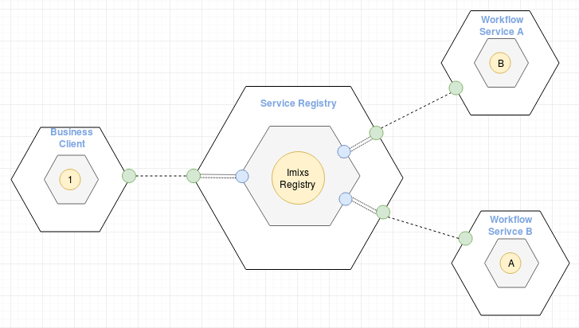

# Imixs-SAGA Registry

The Imixs-SAGA Registry is a Service Registry for the [Imixs-Microservice platform](https://github.com/imixs/imixs-microservice). 
The main goal of this service is the registration and discovery of workflow services within a microservice architecture.

In order to start a new business process within the Imixs-Microservice platform, consisting of different business services, a client needs to know the service endpoints of a specific workflow service and the process definition. In a traditional application design, the process definitions can be configured in a static way, e.g. in a configuration file that’s occasionally updated during the deployment process. 
In a microservice architecture, this process is much more dynamic because workflow services and their process definitions, regardless of the general release cycle, can be added or become unavailable for a variety of reasons.
Consequently, a client must use a service registry to discover a workflow service matching a concrete business event. In this way a client can call the registry to start a new workflow without knowing the details of its behavior. 

## Business Events

The key component in the Imixs-Registry is a mapping table between a business event and available workflow service instances.
A business event is a data object that is created by a client to start a new workflow instance. For example, this can be a shopping cart from a webshop that contains the order details (for example, an order ID, a customer ID).

The mapping between a business event and a workflow service is essentially based on business attributes provided by a specific business context (or bounded context in DDD). A business event can match on one or many different workflow services: 

Business Event               | Workflow Service Instance
---------------------------- | -------------------------------
OrderID, CustomerID          | Order Workflow, Warranty Workflow 
InvoiceID, Customer ID       | Invoice Workflow, Credit Workflow

By providing additional business rules to a mapping table, the Imixs-Registry can discover a designated workflow service also in complex business cases.  

## Self Registration of a Imixs-Microservice

Adding a new workflow service to the registry at runtime is one of the core features of the Imixs-Registry

The Imixs-Registry provides an API for the registration of a Imixs-Microservice. This allows the Imixs-Registry to automatically update the mapping table  when a new workflow service is stared or becomes unavailable. 

A new Imixs-Microservice instance can be automatically registered with the Imixs-Registry during startup. This prevents the need for to edit the mapping table manually at runtime.  A workflow service instance periodically invokes the registration during runtime in order to prevent its registration from expiring.

**Benefits:**

 - Only the workflow service must have the technical knowledge and its relation to a business event to maintain the mapping.
 - If the registry service goes down and restarts again, the mapping table will be rebuild automatically (ping mechanism)
 - If a Imixs-Microservice goes down, the mapping table will updated (health check)
 - If a Imixs-Microservice goes down and starts again, the mapping table will be updated automatically (ping mechanism)
 
### Setup

To setup an Imixs-Microservice with the Self Registration feature the following configuration properties can be injected:

	IMIXS_REGISTRY_SERVICEENDPOINT: the url of the Imixs-Registry instance
	IMIXS_REGISTRY_INTERVAL: an interval in milliseconds (default 120000) to ping the registry

 
## Service Discovery
 
A client can start a new process instance by sending a business event to the Imixs-Registry. The discovery process will select a matching Imixs-Microservice and forward the business event to initialize a new workflow instance.

Read more about the discovery process in the section [Service Discovery](docs/DISCOVERY.md).
 
 
## Derived Index

The Imixs-Registry supports a derived index over all registered Imixs-Microserives. This index allows a client to search for running process instances, regardless of where those process instances run. This index is based on Apache Solr which is a highly reliable, scalable and fault tolerant search engine.

Read more about the derived index in the section [Indexing](docs/INDEX.md).

